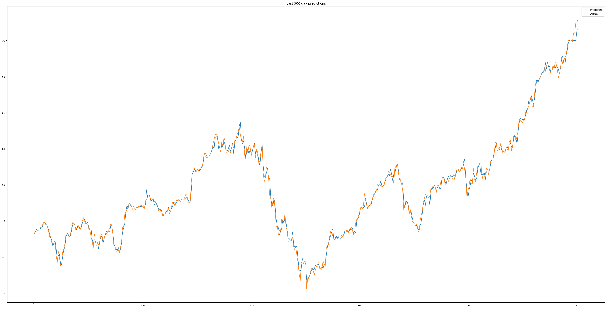
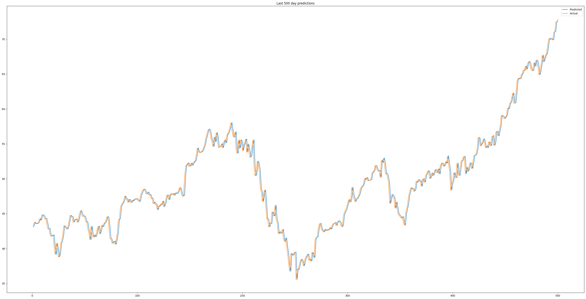

# Stock Price Prediction Model

## Overview

This repository contains an analysis and predictive model for stock prices, specifically focusing on Apple Inc. (AAPL). By leveraging historical stock data, this project utilizes machine learning models to forecast future stock prices. The main objective is to ascertain whether today's stock price will ascend or descend based on past trends.

## Dataset Source

The stock price data for Apple Inc. was sourced from [Yahoo Finance](https://finance.yahoo.com/).

## Data Preprocessing

- The historical stock price data was retrieved using the `yfinance` library.
- Only the "Close" prices were considered for the prediction modeling.
- A sliding window technique was employed to align current prices with their subsequent values.

## Exploratory Data Analysis

- A visualization was created for the last 500 days of both predicted and actual stock prices.
- The correlation between current and future stock prices was examined.

## Feature Engineering

- The dataset was standardized to ensure uniformity across features.
- Data was prepared and formatted for integration with machine learning algorithms.

## Machine Learning Models

For the stock price prediction, the following regression models were utilized:

1. **Random Forest Regressor**: Chosen for its robust ensemble learning features.
2. **Linear Regression**: Implemented as a fundamental regression model for comparison.

## Hyperparameter Tuning

To optimize the Random Forest Regressor's performance, a GridSearchCV was employed for hyperparameter tuning. This process identified the optimal number of estimators, enhancing the model's predictive accuracy.

## Evaluation Metrics

The accuracy of the prediction models was gauged using the root mean square error (RMSE) metric, providing a quantitative measure of the model's performance.

## Results Summary

The finalized model for stock price prediction yielded the following results based on the root mean square error (RMSE) metric:

- **Linear Regression**: Achieved an RMSE of 0.24
- **Random Forest Regressor**: Recorded an RMSE of 0.29

The observed RMSE values indicate that the Linear Regression model performed slightly better in this specific scenario compared to the Random Forest Regressor. However, it's essential to note that the efficacy of a model can vary based on multiple factors, including the dataset, features, and the problem's complexity. Further iterations and feature engineering could potentially enhance the performance of both models.

Random Forest model result

Logistic Regression model result

## Conclusion

This project underscores the capabilities of machine learning in predicting stock prices based on historical data patterns. The insights derived from this analysis may serve as a valuable resource for investors seeking data-driven perspectives on market trends.

## Contact Information

For further inquiries or feedback, please feel free to reach out to [prabathwijethilaka50@gmail.com](mailto:prabathwijethilaka50@gmail.com).
